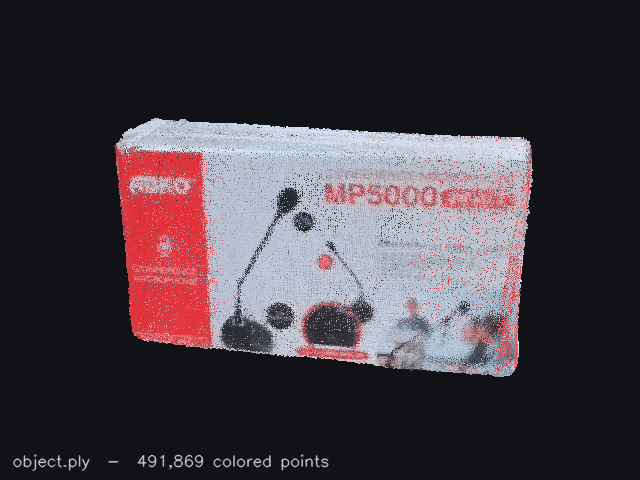
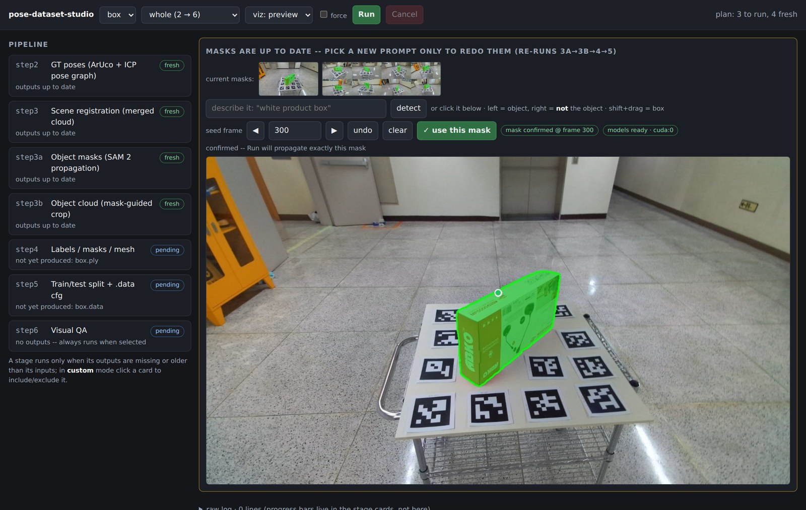
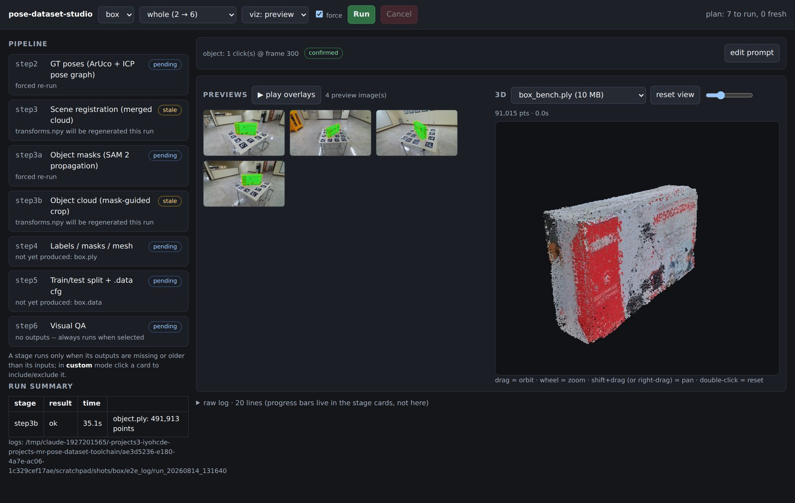
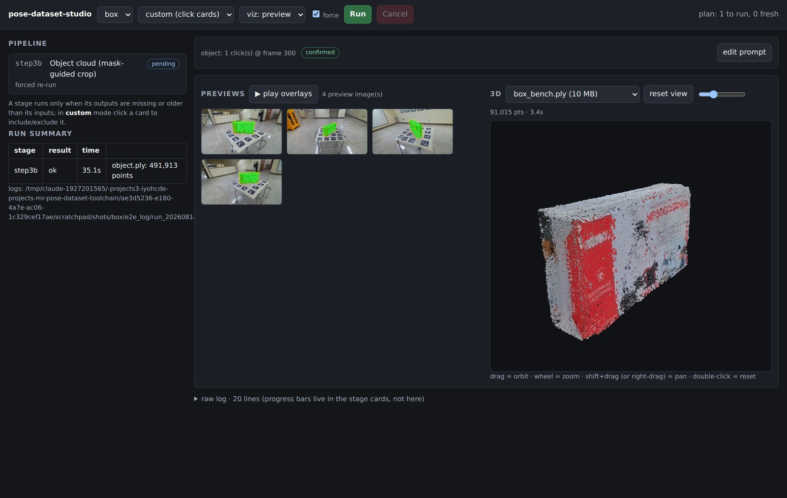
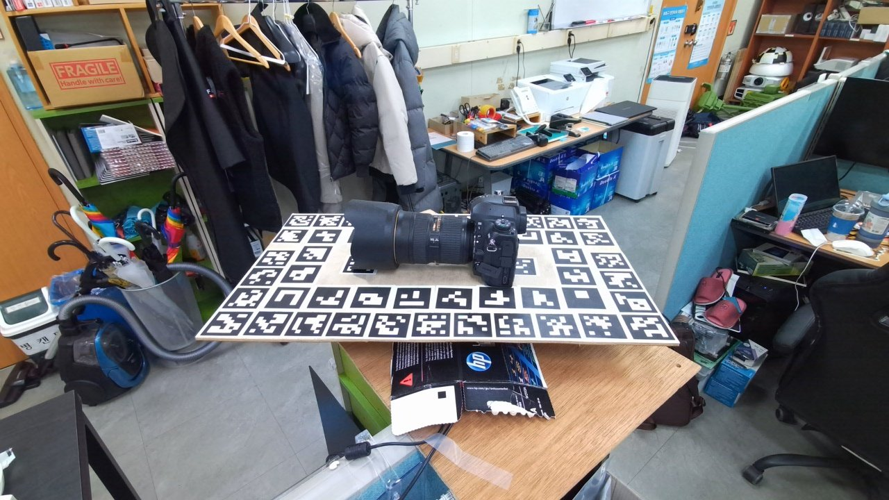
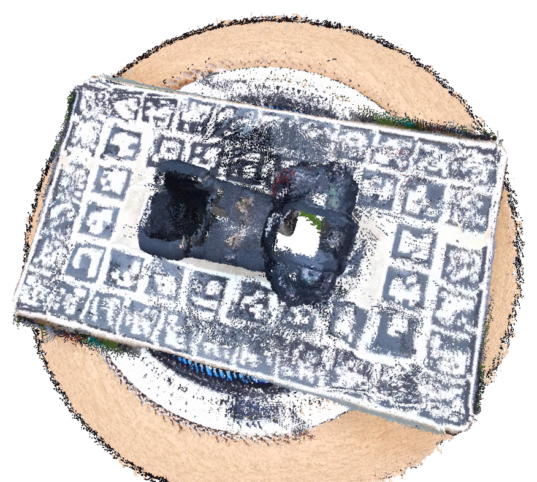
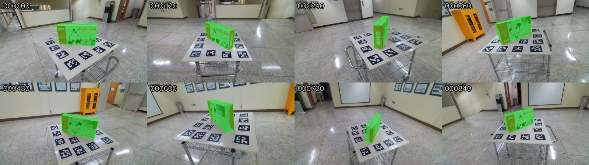
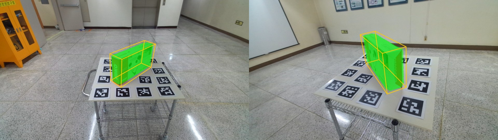

# pose-dataset-studio

**Record → click the object once → train-ready 6-DoF pose dataset.** An RGB-D dataset studio with SAM 2 auto-segmentation, GPU acceleration (~5 min end to end on the 930-frame reference sequence) and a browser dashboard that runs the whole pipeline — originally a customized [ObjectDatasetTools (ODT)](https://github.com/F2Wang/ObjectDatasetTools) pipeline built for:

> Oh, I., Jang, G., Song, J., Son, M., Kim, D., Yun, J., Ko, K., *"A mixed reality-based remote collaboration framework using improved pose estimation"*, **Computers in Industry** 174 (2026) 104414. [[link]](https://www.sciencedirect.com/science/article/pii/S0166361525001794)

It records an RGB-D sequence with an **Azure Kinect**, recovers ground-truth 6-DoF poses from **ArUco markers**, reconstructs the scene, and generates the labels, masks and object mesh required to train the improved singleshotpose network (the training code accompanies the paper in [mr-remote-collaboration](https://github.com/inyoungoh-cde/mr-remote-collaboration)).


*One prompt on one frame — SAM 2 carries the mask through the whole orbit.*

 

*What you get: a projected 3D box + pixel mask on every frame, and the reconstructed object.*

## Installation

Tested with [uv](https://docs.astral.sh/uv/) + Python 3.10 — the CPU pipeline on Windows and Linux, the GPU/auto-segmentation stack on Linux (CUDA). The setup is **three layers**; take only what you need. From the folder above this one:

```bash
# 1) core pipeline — steps 2-6 and the studio
uv venv --python 3.10 .venv
uv pip install --python .venv -r pose-dataset-studio/requirements.txt

# 2) automatic object segmentation + GPU acceleration
#    (steps 3a/3b, the --gpu paths, the live mask preview)
uv pip install --python .venv "sam2==1.1.0" "transformers==5.15.0"

# 3) recording with an Azure Kinect — step 1 only
uv pip install --python .venv --no-deps pykinect-azure
```

**Layer 2 — what actually happens.** `sam2` (SAM 2.1) and `transformers` (Grounding DINO) are pure-Python/PyTorch packages: nothing is compiled locally, and `torch` is pulled in automatically (CUDA wheels on Linux; verified with torch 2.13.0+cu130). The two model checkpoints — `facebook/sam2.1-hiera-large` and `IDEA-Research/grounding-dino-base`, ~1.6 GB total — download from the Hugging Face hub **on the first run** and live in `~/.cache/huggingface` afterwards; a machine without internet can copy that cache folder over, or point `--sam2-model` / `--detector-model` at local paths. Installing layer 2 does not move layer 1's pins (numpy stays 1.26.4, opencv stays 4.6.0.66 — verified with uv's resolver). Skip the layer entirely and the pipeline still runs end to end: segment the object by hand in CloudCompare instead of steps 3a/3b, and omit `--gpu`.

**GPU acceleration** (the `--gpu` path inside steps 2, 3 and 3b) additionally relies on Open3D's CUDA build, which the pinned **Linux** wheel already ships — check with `python -c "import open3d; print(open3d.core.cuda.is_available())"`. The Windows wheel is CPU-only, so on Windows run without `--gpu` — every step keeps its CPU path as the default, and a script asked for a GPU it cannot find says so instead of falling back silently.

**Layer 3** is installed `--no-deps` because `pykinect-azure` declares `opencv-python`, which would overwrite `opencv-contrib-python` (both ship the same `cv2` package — never install them together). The **Azure Kinect Sensor SDK** itself is a separate non-pip install.

Non-pip prerequisites:
- **Azure Kinect Sensor SDK** — step 1 (recording) only
- **CloudCompare** or MeshLab — only if you segment the object by hand instead of running steps 3a/3b

Verified end to end in a fresh venv built exactly as above: steps 2–6 and the studio (`--gpu` included) — install 17 s on a warm uv cache, raw inputs to train-ready folder in 247 s on one A100.

### Try it without a Kinect

No Azure Kinect on hand? [`dig_camera.zip`](https://github.com/inyoungoh-cde/pose-dataset-studio/releases/tag/pose-dataset-studio-sample-v1) is a real capture (529 frames) — step 1's output, so it lets you start at step 2:

```bash
unzip dig_camera.zip -d pose-dataset-studio/
cd pose-dataset-studio
python run_e2e_web.py dig_camera --gpu     # the whole pipeline from one page
#   or step by step: python 2_compute_gt_poses.py dig_camera ; ...
```

## Pipeline

Every script takes just the sequence folder and prints the next command when it finishes:

```bash
python 1_record_azurekinect.py mycup      # RGB-D capture  -> JPEGImages/, depth/, intrinsics.json
python 2_compute_gt_poses.py   mycup      # marker poses   -> transforms.npy, log.txt
python 3_register_scene.py     mycup      # merged scene   -> registeredScene.ply
python 3a_segment_object_masks.py mycup --prompt "white mug"   # object masks -> objmask/
python 3b_segment_object_cloud.py mycup   # mask-guided 3D crop -> object.ply
#  (or, the old way: segment registeredScene.ply by hand in CloudCompare -> object.ply)
python 4_create_label_files.py mycup      # labels/masks   -> labels/, mask/, transforms/, mycup.ply
python 5_create_config2split.py mycup     # split + cfg    -> train.txt, test.txt, mycup.data
python 6_inspect_labels.py     mycup      # visual QA
```

Everything a step produces is written **inside the sequence folder**, so the finished folder is a self-contained unit you move under singleshotpose's data root as-is.

### Or run it end-to-end: the studio

The individual steps above stay the reference, but the browser dashboard drives them all from a single command (full docs: `doc/DETAILS.md` §8) — on a headless GPU server, forward the port once (`ssh -N -L 8770:localhost:8770 <host>`) and it opens in your own browser; nothing else to install:

```bash
python run_e2e_web.py mycup --gpu 0
```



*Pick the object, see the SAM mask instantly, and nothing runs until you press "use this mask" — no unseen mask ever propagates.*



*While it runs: real progress bars per stage (steps 2–3 and the mask propagation execute in parallel), previews as they appear, the raw log folded away.*



*When it finishes: previews and QA overlays on the left, the reconstructed object in an orbit/zoom/pan 3D viewer on the right — no CloudCompare needed for a first look.*

Both take just the sequence folder. They plan first — a stage only runs when its outputs are missing or older than its inputs, so re-running after a new 3a pass redoes exactly 3b→4→5 and nothing else — then ask for the step-3a object prompt *only if step 3a is actually going to run* (type what it is, click it, or drag a box, with a live SAM mask preview). `--mode whole` (default) is steps 2–6, `--mode label` is 2–5, `--mode step3a,step3b` runs a subset; `--viz off|preview|full` controls how much you watch. Every run echoes each stage's exact command and writes per-stage logs plus a `manifest.json` under `<sequence>/e2e_log/`.

On a machine with a CUDA GPU, add `--gpu 0`: steps 2, 3 and 3b take their GPU path (one script per step — the GPU is a flag inside it, never a separate file), the live mask preview shares the same device, and step 3a runs in parallel with steps 2–3 (they are independent). `--gpu 0,1` additionally gives step 3a the second GPU during that overlap (worth a few percent); a bare `--gpu` picks the freest device; omitting `--gpu` stays CPU-only. Measured on the 930-frame reference sequence: **raw inputs → train-ready folder in ~5 minutes instead of ~52** (step 2 13×, step 3 18×, step 3b 3×; step 4 is 8× from vectorisation alone and needs no GPU), with measured-equivalent output — poses within 0.004°/0.05 mm, `diam` within 4 µm of the reference (`doc/DETAILS.md` §9).

### 1. Preparation

Print an ArUco marker board (IDs from `DICT_6X6_250`) and place the object on it. Make sure 2–3 markers are visible in every frame and no ID appears twice.



### 2. Record a sequence

```bash
python 1_record_azurekinect.py mycup
```

Records 720p color + aligned 16-bit depth after a 5 s countdown (space = pause, q = stop). Prefer moving the camera around a static object; a turntable also works (step 3 auto-detects which one you did).


### 3. Compute ground-truth poses

```bash
python 2_compute_gt_poses.py mycup
```

ArUco corner matching with per-marker depth filtering and RANSAC, ICP fallback, pose-graph optimization. Per-edge diagnostics go to `log.txt`.

### 4. Register the scene

```bash
python 3_register_scene.py mycup
```

Merges all frames into `registeredScene.ply` with a data-derived merge radius, vote-based noise removal and a crop to the marker board:



### 5. Segment the object

`object.ply` — the object and nothing else — used to be cut out of the scene by hand in CloudCompare. That single manual step decided the quality of everything downstream: a cut that leaves part of the table in inflates the oriented bounding box step 4 fits, and one that shaves the object off loses geometry, and neither is visible until the network trains badly.

Two scripts replace it. You name the object **once**, in one frame, and the rest is measured:

```bash
python 3a_segment_object_masks.py mycup --prompt "white mug"   # -> objmask/, seg_preview/
python 3b_segment_object_cloud.py mycup                        # -> object.ply
```

**3a — which object.** Grounding DINO turns the phrase into a box on the seed frame (it is open-vocabulary, so the object does not have to be a class anything was trained on), SAM 2 turns that box into a pixel-accurate mask, and SAM 2's video memory carries the mask through the whole sequence — forwards *and* backwards from the seed — without another prompt. The ArUco quads are subtracted from every mask, because a mask that leaks onto the board drags the board into the object cloud.

**3b — which points.** Every frame votes on every point of `registeredScene.ply`: project the point with that frame's pose from step 2, compare its depth with the measured depth at that pixel — further away means it is occluded in this view and the frame *abstains* rather than voting it away — and if it lies on the measured surface, the mask decides object or background. A point survives if enough frames saw it and enough of them agreed. A mask that is wrong in a few frames is outvoted; a hand-drawn cut is not. `--source depth` skips step 3 entirely and fuses the masked depth directly, which gives a denser object.

#### Naming the object without a display

The pipeline usually runs on a GPU box over SSH, so none of the three ways needs an X server:

| | |
|---|---|
| `--prompt "white mug"` | free text, fully scriptable — nothing to click, nothing to forward |
| `--pick` | a one-page picker served on localhost by Python's own `http.server`. Click the object (right-click pushes a wrong region back out), drag a box, or type a phrase; the mask is recomputed and redrawn after every action. On a **headless server**, forward the port once — `ssh -N -L 8765:localhost:8765 user@host` — and open `http://localhost:8765/` in the browser on your own machine. On a **local machine** the same URL just opens (`--pick-open` launches it for you). |
| `--click X,Y` / `--box X0,Y0,X1,Y1` | coordinates you already have, e.g. copied out of the picker to put in a script |

`--seed-only` stops after the seed frame, which is the cheap way to iterate on a phrase before committing to 900 frames.

#### Knowing it worked

Nothing is trusted silently. 3a re-runs the text prompt every `--verify-stride` frames and reports (or, with `--reanchor`, repairs) any frame where the tracked mask no longer matches the detection; it flags empty masks and masks far off the median area; and it writes `seg_preview/contact.jpg`, the whole sequence at a glance:



3b prints the object's oriented bounding box in centimetres — check it against the physical object with a ruler, it is the one number that tells you whether a piece of the table survived or part of the object was lost — and reprojects the result onto real frames with that box drawn:



Over SSH, `python -m http.server -d mycup/seg_preview 8000` is enough to look at all of it in a browser.

#### The manual way still works

Dark or glossy objects return almost no depth, and no amount of mask accuracy invents points that the sensor never measured. When that happens, open `registeredScene.ply` in CloudCompare, delete everything except the object, subsample to ~2 mm spacing (Edit > Subsample > Space) and save as `object.ply` inside the sequence folder — ASCII PLY. Step 4 does not care which of the two produced it.

### 6. Create labels, masks and the object mesh

```bash
python 4_create_label_files.py mycup
```

Triangulates `object.ply` (ball pivoting, vertex colours preserved), aligns the mesh to its OBB with the centroid on the origin, and writes singleshotpose-format `labels/`, pixel masks (`mask/`), per-frame poses (`transforms/`) and the ASCII mesh `mycup.ply`.

### 7. Split and config

```bash
python 5_create_config2split.py mycup
```

Writes `train.txt` / `test.txt` / `training_range.txt` and a complete `mycup.data` cfg — object diameter, intrinsics and image size are all measured from the folder, nothing is typed by hand. The cfg paths use the `custom/` prefix (`--sspose-root`) describing where the folder will live **after** you move it under singleshotpose.

### 8. Inspect

```bash
python 6_inspect_labels.py mycup
```

Overlays mask + projected 3D bounding box on every frame (the result GIF at the top).

## Notes

- Marker-based registration is the only reliable signal for a **turntable** capture: the in-plane rotation of a flat board is geometrically invisible to ICP. The pipeline detects the capture mode from the data and warns accordingly.
- The `.data` cfg must contain no comments (singleshotpose's parser splits every non-empty line on `=`).
- Dark or glossy objects return little depth; a matte light-grey coating (or a white drape for the geometry pass) improves reconstruction more than extra frames do.

Full documentation — per-script CLI reference, every change against the original ODT code with measurements, known limitations, and a registration troubleshooting guide — is in [`doc/DETAILS.md`](doc/DETAILS.md).

## Citation

If you use this toolchain, please cite:

```bibtex
@article{oh2026mixed,
  title   = {A mixed reality-based remote collaboration framework using improved pose estimation},
  author  = {Oh, Inyoung and Jang, Gilsang and Song, Jinho and Son, Moongu and Kim, Daewoon and Yun, Junsang and Ko, Kwanghee},
  journal = {Computers in Industry},
  volume  = {174},
  pages   = {104414},
  year    = {2026},
  doi     = {10.1016/j.compind.2025.104414}
}
```

## License

[MIT](LICENSE). Derived from [ObjectDatasetTools](https://github.com/F2Wang/ObjectDatasetTools) (MIT, © 2019 s0972456), whose copyright notice is retained in the LICENSE file. Built to train [singleshotpose](https://github.com/microsoft/singleshotpose) (MIT, Microsoft). The automatic segmentation uses [SAM 2](https://github.com/facebookresearch/sam2) (Apache-2.0, Meta) and [Grounding DINO](https://github.com/IDEA-Research/GroundingDINO) via [transformers](https://github.com/huggingface/transformers) (Apache-2.0) as pip dependencies — nothing from either project is vendored into this repository.
